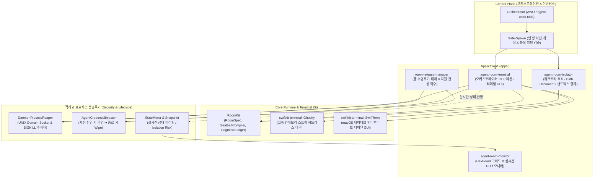
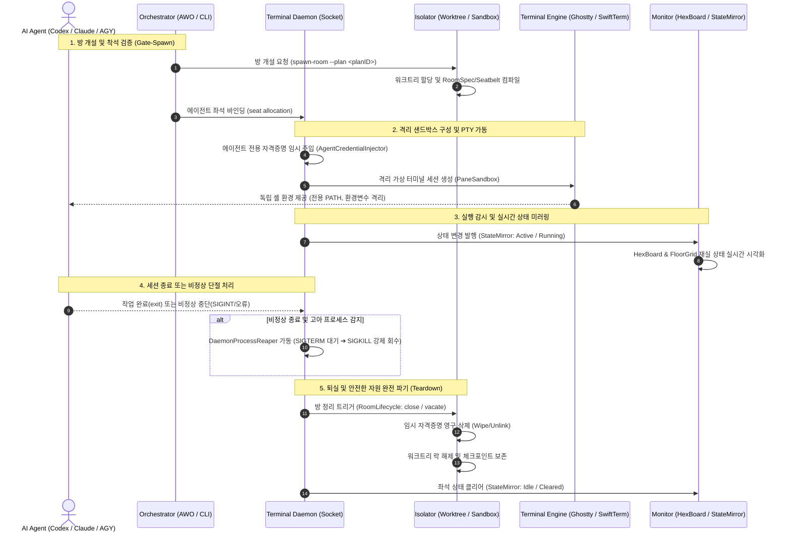

# agent-room-mono

> **차세대 다중 AI 에이전트(Codex, Claude, Antigravity) 가상 터미널 오케스트레이션 및 격리 런타임**

`agent-room-mono`는 단일 호스트 환경에서 여러 자율 AI 에이전트가 동시에 협업할 때 발생하는 **터미널 경합, 파일 충돌, 좀비 프로세스, 권한 탈루** 문제를 해결하기 위해 설계된 **방(Room) & 좌석(Seat) 기반 가상 터미널 오케스트레이션 모노레포**입니다.

---

## 1. Why Agent Room? (배경 및 문제 정의)

### 💥 기존 멀티 에이전트 환경의 문제점 (Before)
1. **터미널 세션 경합 (Terminal Contention)**
   - 여러 에이전트가 단일 TTY 및 동일 작업 트리를 공유할 때, 셸 I/O 버퍼가 뒤섞이고 동시 파일 쓰기로 인한 레이스 컨디션(Race Condition)이 발생합니다.
2. **좀비 프로세스 창궐 (Zombie Sprawl & Resource Leak)**
   - 백그라운드 태스크나 서브에이전트가 비정상 종료(SIGINT, 소켓 단절 등)될 때, 상위 제어 없는 고아(Orphan) 프로세스로 남아 CPU, 메모리, 파일 디스크립터(FD), 소켓 자원을 지속적으로 점유합니다.
3. **블랙박스 실행 및 가시성 부재 (Black-Box Execution)**
   - 어떤 에이전트가 어느 디렉터리에서 무슨 도구를 실행 중인지 파악하기 어렵고, 세션 생명주기와 자격증명(Credential) 반납 여부를 실시간 추적할 수 없습니다.
4. **단순 터미널 분할 도구(tmux, iTerm Split)의 한계**
   - 단순 UI 타일링 도구는 에이전트 단위의 **Seatbelt 샌드박스 정책**, **동적 자격증명 주입/영구 파기(Wipe)**, **프로세스 생명주기 감시**, **테넌트 격리**를 제공하지 못합니다.

### 🛡️ Agent Room이 제공하는 솔루션 (After)
| 핵심 축 | 기존 방식 (Before) | Agent Room 체제 (After) |
| :--- | :--- | :--- |
| **작업 단위** | 단일 TTY / 공유 셸 세션 | **1 에이전트 1 좌석 (Seat) & 룸 (Room) 바인딩** |
| **보안 경계** | 호스트 전체 권한 노출 | **RoomKit 기반 Seatbelt 샌드박스 (`sandbox-exec`) 컴파일** |
| **자격증명 관리** | 호스트 환경변수/키체인 직접 접근 | **진입 시 임시 주입 (`Injector`) ➔ 퇴실 시 영구 파기 (`Wipe`)** |
| **프로세스 수명** | 프로세스 누수 및 좀비 잔류 | **`DaemonProcessReaper`의 SIGTERM ➔ SIGKILL 강제 회수** |
| **터미널 렌더링** | 단일 무거운 터미널 에뮬레이터 | **헤드리스 고속 스트림 (`Ghostty`) + 네이티브 UI (`SwiftTerm`) 분리** |
| **관측성 (Obs)** | 텍스트 로그 직접 검색 | **HexBoard / HUD 실시간 상태 미러링 (`StateMirror`)** |

---

## 2. 시스템 아키텍처 (System Architecture)

`agent-room-mono`는 제어 평면(Control Plane), 애플리케이션 계층(Apps), 런타임 가상 터미널 엔진(Swift Kits), 보안/생명주기 하위 시스템(Security & Lifecycle)으로 유기적으로 결합되어 있습니다.



---

## 3. 핵심 비즈니스 로직 & 생명주기 (Lifecycle Flow)

에이전트가 생성되어 방에 착석하고, 작업을 수행한 후 퇴실하여 리소스가 안전하게 회수되기까지의 전체 흐름입니다.



---

## 4. 핵심 기술 요소 (Core Capabilities)

### 🏢 방(Room) & 좌석(Seat) 체제
- **Gate-Spawn 프로토콜**: 방 밖에서 일하는 에이전트를 원천 차단합니다. 서브에이전트 투입 전 반드시 대기 방(`spawn-room`)을 사전 개설하고 1인 1좌석(`seat allocation`)에 착석시킵니다.
- **다중 테넌트 격리**: `StateRootKit` 기반으로 테넌트별 상태 디렉터리(`~/.agent-room-terminal/` 또는 `~/.tenants/<t>/`)를 엄격히 분리하여 데이터 오염을 방지합니다.

### 🖥️ 듀얼 PTY 가상 터미널 엔진 (`swiftkit-terminal`)
- **Ghostty Headless Engine (`TerminalEngineGhostty`)**: GUI 렌더링 오버헤드 없이 백그라운드에서 인메모리 바이트 스트림으로 에이전트 CLI 입출력을 고속 처리합니다.
- **SwiftTerm Interactive Engine (`TerminalEngineSwiftTerm`)**: 개발자가 에이전트의 작업 과정을 직접 관측하고 개입할 수 있는 macOS 네이티브 인터랙티브 뷰를 제공합니다.
- **`PaneSandbox`**: 세션마다 독립된 홈 디렉터리, inbox, 환경변수를 결속하여 에이전트 간섭을 방지합니다.

### 🔒 샌드박스 & 안전한 프로세스 생명주기
- **`SeatbeltCompiler` (L3)**: `RoomSpec`을 기반으로 파일시스템 쓰기 허용 범위(`allowWrite`), 허용 바이너리 경로, 프록시 포트를 분석하여 macOS `sandbox-exec` 프로필을 순수 컴파일합니다.
- **`DaemonProcessReaper`**: UNIX Domain Socket(`LOCAL_PEERPID`) 추적 및 `pgrep` 기반 프로세스 감시를 통해 비정상 세션 발생 시 SIGTERM 유예(500ms) 후 SIGKILL을 순차 전송하여 **좀비 프로세스를 0(Zero)**으로 유지합니다.
- **`AgentCredentialInjector` & `RoomLifecycle`**: 방 개설 시 최소 권한 토큰을 복사 주입하고, 방 닫기(`close`), 비우기(`vacate`), 정리(`cleanup`), 해체(`dismantle`) 시 모든 자격증명 사본을 **영구 삭제(wipe/unlink)**합니다.

### 📊 관측성 & 상태 미러링 (`agent-room-monitor`)
- **HexBoard & FloorGrid**: 육각형 그리드 위에서 전체 에이전트의 재실 현황, 작업 위치, 자원 점유 상태를 실시간 시각화합니다.
- **Isolation Risk 감시**: 테넌트 경계 위반, 권한 우회 시도, 비정상 프로세스 점유를 실시간 탐지합니다.

---

## 5. 모노레포 패키지 구성 (Repository Structure)

```
agent-room-mono/
├── apps/
│   ├── agent-room-terminal/    # 멀티 에이전트 터미널 룸 오케스트레이터 (GUI / Daemon / CLI)
│   ├── agent-room-monitor/     # 에이전트 룸 상태 및 프로세스 생명주기 실시간 모니터 (HexBoard / HUD)
│   ├── agent-room-isolator/    # 룸 격리, 워크트리 바인딩 및 프로세스 샌드박스 경계 제어
│   └── room-release-manager/   # 룸 배포, 릴리스 및 해제 관리자
│
├── swiftkit/                   # 핵심 프레임워크 킷
│   ├── RoomKit/                # RoomSpec, SeatbeltCompiler, RoomCognitiveLedger, PathPlanner
│   ├── StateRootKit/           # 테넌트/사용자 상태 디렉터리 SSOT 조립
│   ├── CommandKit/             # 데드락 면역 SafeProcessRunner 및 명령 체계
│   └── StateMirrorKit/         # 실시간 상태 관측성 미러링 어댑터
│
├── swiftkit-terminal/          # PTY 가상 터미널 엔진
│   ├── TerminalEngineKit/      # 터미널 엔진 추상화 인터페이스, PaneSandbox, 이벤트 프로토콜
│   ├── TerminalEngineGhostty/  # Ghostty 기반 고속 인메모리 스트림 헤드리스 엔진
│   └── TerminalEngineSwiftTerm/# SwiftTerm 기반 macOS 네이티브 GUI 터미널 엔진
│
├── swiftkit-appscaffold/       # 공통 macOS 앱 아키텍처 스캐폴딩
└── swiftkit-sparkle/           # 인앱 자동 업데이트 프레임워크
```

---

## 6. CLI 주요 명령어 (CLI Reference)

### `agent-room-terminal`
| 명령 | 설명 | 비고 |
| :--- | :--- | :--- |
| `capabilities` | Interop 계약 및 지원 커맨드 명세 출력 (`--json`) | 계약 정본 |
| `open --room <id>` | 룸 폴더를 조립하고 격리된 룸 세션 가동 | 기본 dry-run (`--execute`) |
| `close --room <id>` | 룸 터미널을 정지하고 원장 기록 및 자격증명 정리 | 기본 dry-run (`--execute`) |
| `exec --launch <cmd>` | 컴파일된 샌드박스 벽 안에서 단일 명령 실행 및 이벤트 기록 | JSON 출력 지원 |
| `snapshot` | 특정 룸의 터미널 최근 N라인 버퍼 캡처 | 진단 및 모니터링 |
| `doctor` | 런타임 헬스 감사 및 누수된 데몬 소켓/좀비 프로세스 청소 | 자원 복구 |
| `daemon` | 터미널 백그라운드 소켓 데몬 시작/정지/상태 조회 | 소켓 통신 관리 |

### `agent-room-monitor`
| 명령 | 설명 | 비고 |
| :--- | :--- | :--- |
| `snapshot` | 현재 활성 룸 및 좌석 점유 스냅샷 출력 | JSON 지원 |
| `diff` | 이전 스냅샷 대비 변경사항(착석/퇴실/이벤트) 비교 | 상태 추적 |

---

## 7. 빌드 및 테스트 (Build & Test)

모든 앱과 킷은 Swift Package Manager(SPM) 표준을 따릅니다:

```bash
# agent-room-terminal 빌드 및 테스트
cd apps/agent-room-terminal
swift build
swift test

# agent-room-monitor 빌드 및 테스트
cd ../agent-room-monitor
swift build
swift test

# swiftkit-terminal 빌드 및 테스트
cd ../../swiftkit-terminal
swift build
swift test
```

---

## 8. 라이선스 (License)

MIT License
